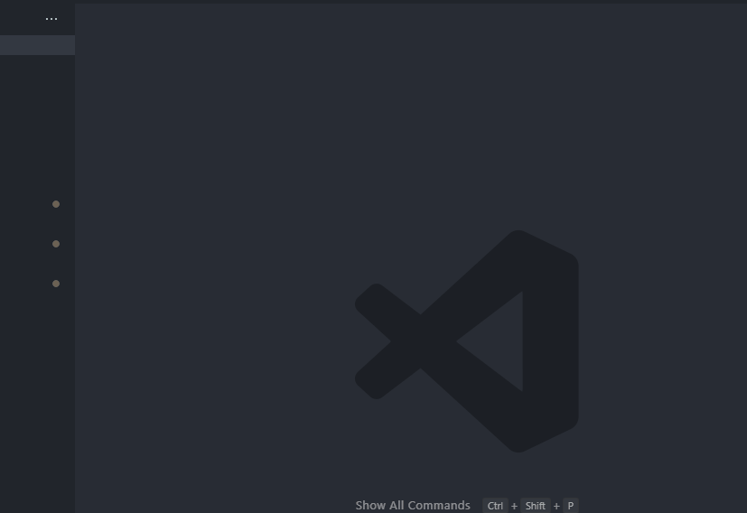
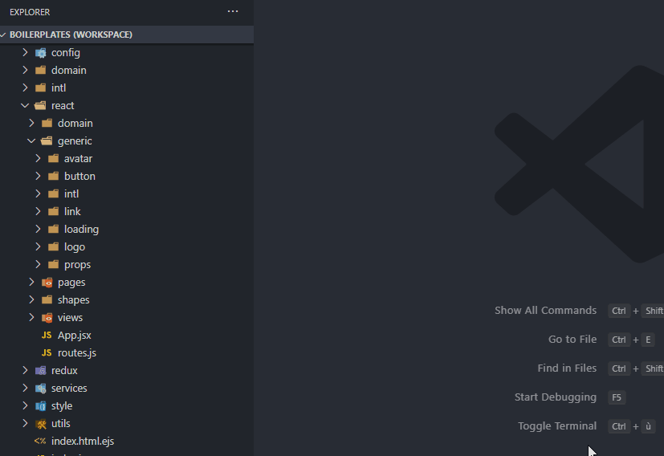

# Visual Studio Code File Template Manager Extension

This is an extension for Visual Studio Code to manage file templates and create new files from said templates.

## Features

1. Create file templates.
    

1. Create new files from templates.
    

3. In the future, create template groups and generate multiple files with a single command.
4. Also in the future, directly select the template in the explorer context menu. I'm waiting for
Visual Studio Code to support dynamic contribution to the context menu for that one.

<!-- ## Extension Settings

Include if your extension adds any VS Code settings through the `contributes.configuration` extension point.

For example:

This extension contributes the following settings:

* `myExtension.enable`: enable/disable this extension
* `myExtension.thing`: set to `blah` to do something -->

<!-- ## Known Issues

Calling out known issues can help limit users opening duplicate issues against your extension. -->

## How to

### Manage your templates

#### Create a new file template

1. Open the command palette (`ctrl+shift+p` on Windows).
2. Select `[TEMPLATES] Create a new file template`.
3. Give a name to your template. It must be unique. Example: `React Component`.
4. Specify the file extension of your template. This will be used when creating new files for this template, and to provide some syntax highlighting while editing the template. Example: `.jsx`.
5. Write your template directly in the editor. The format is [`ejs`](https://ejs.co/). See [Variables in the templates](#variables-in-the-templates) for a list of all variables available when writing your templates.
6. Save your template (`ctrl+s` like a regular file).

#### Edit an existing template

1. Open the command palette (`ctrl+shift+p` on Windows).
2. Select `[TEMPLATES] Edit a file template`.
3. Select the template to edit. If nothing is offered it's probably because you haven't created a template yet.
4. Edit your template and save (`ctrl+s` like a regular file).

#### Delete an existing template

1. Open the command palette (`ctrl+shift+p` on Windows).
2. Select `[TEMPLATES] Remove a file template`.
3. Select the template to remove. If nothing is offered it's probably because you haven't created a template yet.
4. Press `F` to pay respect.

### Use your templates

#### Create a new file from a template
1. Right click in the explorer menu.
2. Select `New file from template`.
3. Select the template to use. If nothing is offered it's probably because you haven't created a template yet.
4. Give a name to your file. It should work like the regular file creation (you can provide a complete path and Visual Studio Code will create the missing folders).
5. Hack.
6. ???
7. Profit.

## Variables in the templates

When defining a template in `ejs`, these are the provided variables:
- `baseFileName`: the file name, minus the extension given at template creation time. E.g. if your file name is `my-component/MyComponent.jsx`, `baseFileName` will be `MyComponent`.

## Release Notes

See the [Changelog](CHANGELOG.md).
